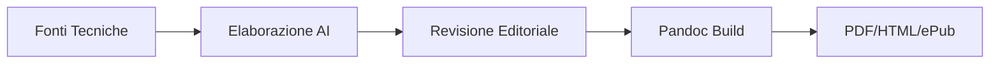
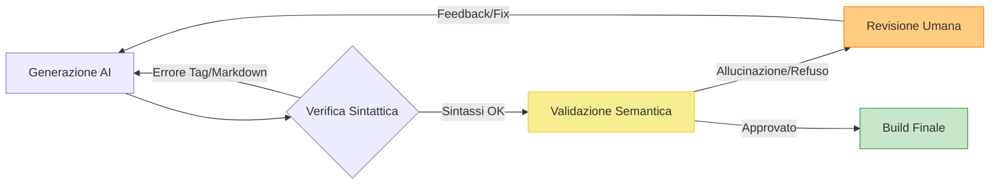

{width=300px height=100px}

# Manuale Operativo IA
## Guida pratica all'utilizzo di un'IA in ambito di comunicazione digitale

## Introduzione

Il presente progetto consiste nella realizzazione di un **Manuale Operativo sull'Intelligenza Artificiale** destinato a un'agenzia di comunicazione digitale. L'obiettivo è trasformare documentazione tecnica complessa (OpenAI Cookbook) in una guida accessibile per figure non tecniche. Il progetto integra tecniche di *Prompt Engineering* avanzate e un flusso di gestione documentale automatizzato per la pubblicazione multicanale (PDF, HTML, ePub).

## Ideazione 

### Tema
Il prodotto editoriale affronta l'integrazione delle tecnologie di Intelligenza Artificiale Generativa nei flussi di lavoro di un'agenzia di comunicazione. Con l'attenzione posta principalmente sul prompt engineering, il manuale è suddiviso in tre aree chiave:
* **Creazione di contenuti (Text Generation):** Ottimizzazione della produzione di contenuti testuali tramite diverse tecniche di prompting.
* **Riconoscimento Multilingua e Analisi Semantica(Language Detection):** Rilevazione automatica delle lingue e comprensione dei processi alla base (*Embeddings*).
* **Analisi e Affidabilità dei dati(Cross-tabular Analysis):** Protocolli per l'analisi incrociata di tabelle dati senza errori numerici e/o allucinazioni.

**Tendenza dell'attenzione:** L'interesse attuale si sta spostando dal semplice "uso del chatbot" verso la necessità di **validazione e affidabilità**. La tendenza del settore non è più solo la velocità di produzione, ma la capacità di costruire processi che garantiscano l'assenza di "allucinazioni", rendendo il tema del controllo qualità e della validità estremamente rilevante e attuale.

> LM2 slide 28

### Destinatari
Il manuale è progettato per assistere i lavoratori in situazioni di necessità operativa, fornendo protocolli chiari quando la complessità o il volume dei dati richiedono un supporto metodologico.

#### Persona 1: Martina, Senior Copywriter
* **Profilo:** 34 anni, responsabile della coerenza creativa per 5 account internazionali.
* **Bisogno:** Gestire picchi di lavoro multilingua senza sacrificare la precisione stilistica del brand.
* **Scenario d'uso:** Martina deve declinare una campagna social in 4 lingue diverse sotto una scadenza imminente. Temendo che l'IA possa generare traduzioni troppo letterali o "piatte", consulta il manuale per impostare un protocollo di *Persona Adoption* e *Language Detection*. Il manuale la assiste nel configurare i delimitatori corretti, permettendole di agire come supervisore di semilavorati già strutturati, validando rapidamente la coerenza linguistica invece di dover tradurre e correggere ogni singola riga manualmente.

#### Persona 2: Luca, Digital Strategist & Data Analyst
* **Profilo:** 29 anni, incaricato della reportistica e delle analisi di performance.
* **Bisogno:** Estrarre insight affidabili da dataset eterogenei evitando errori di calcolo fatali nei report per i clienti.
* **Scenario d'uso:** Luca deve incrociare i dati di spesa pubblicitaria (File A) con le conversioni effettive del CRM (File B). Consapevole della tendenza dell'IA a inventare correlazioni se lasciata libera, utilizza il manuale. Seguendo rigorosamente il protocollo di "Scomposizione Sequenziale" e "Validazione delle Formule", Luca guida l'IA passo dopo passo nella lettura dei file. Il manuale funge da guida procedurale che gli permette di produrre un report incrociato, eliminando il rischio di allucinazioni numeriche e sviste manuali tipiche dei fogli di calcolo complessi.

> LM2 slide 29-32

### Requisiti di accettazione
Perché il manuale sia considerato valido dai destinatari (Martina e Luca), deve soddisfare i seguenti requisiti di accettazione:

* **Precisione Operativa:** Ogni modulo deve contenere almeno un "Prompt Box" pronto all'uso (copia-incolla) che sia stato validato per ridurre il rischio di allucinazioni.
* **Accessibilità Multiformato:** Il prodotto deve essere fruibile sia da postazione desktop (durante l'analisi dati) che da dispositivi mobile (consultazione rapida durante i meeting), senza perdita di struttura.
* **Standard di Riferimento:** Si adottano gli standard **Markdown** per la sorgente e **Open Container Format (EPUB)** per la distribuzione mobile, garantendo l'interoperabilità e la conservazione a lungo termine.

**Modelli di fruizione:** Il modello più efficace è quello **ipertestuale e non lineare**. Mentre la lettura del singolo modulo è lineare per garantire la coerenza strutturale, l'indice deve permettere un accesso rapido alle soluzioni specifiche per i problemi del momento.

**Innovazione:** L'innovazione risiede nel **processo di fruizione**. Invece di un manuale statico, si è proposto un sistema di documentazione "attivo" generato tramite una pipeline automatizzata. Nella qualità dei contenuti, l'innovazione sta nella **mediazione editoriale** che trasforma documentazione per sviluppatori in istruzioni per creativi.

> LM4

### Canali di distribuzione
Il manuale è progettato per una diffusione capillare all'interno dell'ecosistema dell'agenzia:

1.  **Intranet Aziendale (Web/HTML):** Il canale principale per la consultazione rapida durante il lavoro d'ufficio. Formato: **HTML**.
2.  **Repository di Produzione (Markdown):** Per il team tecnico che intende aggiornare i prompt. Formato: **MD**.
3.  **Dispositivi Mobile (ePub):** Per la lettura in mobilità o durante i tempi morti. Formato: **ePub 3.0**.
4.  **Archivio Formale (PDF):** Per la conservazione della versione ufficiale e la stampa di singoli moduli. Formato: **PDF**.

**Identità visuale e Stile:**
Il progetto adotta un'**estetica funzionale-operativa**, dove le scelte di design sono subordinate all'usabilità del contenuto.
* **Tipografia:** Uso di font *sans-serif* per il corpo del testo (leggibilità digitale) e font *monospaced* per i prompt (distinzione netta tra istruzione e testo narrativo).
* **Elementi grafici:** Uso di icone e box colorati per distinguere il
testo dagli esempi, facilitando la scansione visiva della pagina.

## Processo di Produzione

### Acquisizione dei contenuti
Le fonti sono tratte dal repository di OpenAI Cookbook(https://github.com/openai/openai-cookbook). Il costo di acquisizione è nullo a livello economico (fonti libere), mentre parecchio dispendioso temporalmente (analisi attenta di molti documenti).

### Gestione documentale

Il flusso prevede: (i) raccolta sorgenti MD, (ii) traduzione e trasformazione per l'adattamento del registro, (iii) strutturazione dei moduli, (iv) applicazione dello stile CSS, (v) build multiformato tramite Pandoc.

> LM2 slide 14-26

### Tecnologie adottate

L'architettura del progetto si basa su un ecosistema di tecnologie *open-source* e standard aperti, scelti per garantire la massima portabilità del manuale e l'automazione del flusso editoriale.

#### Descrizione delle tecnologie
* **Markdown (MD):** Linguaggio di marcatura leggero scelto come formato sorgente. La sua natura "plain text" permette di mantenere i prompt puliti da metadati invisibili (tipici di Word) che potrebbero corrompere l'output dell'IA.
* **Python (Scripting & Automation):** Linguaggio alla base della pipeline editoriale. Il software sviluppato si divide in due componenti logiche: 
    1. **Fase di Normalizzazione (`cleaning.py`):** Agisce sulla sorgente grezza per eliminare il rumore tecnico (tag JSX, link proprietari, residui di codice) tramite espressioni regolari (Regex).
    2. **Fase di Pubblicazione (`build.py`):** Gestisce il sistema di build multiformato, orchestrando Pandoc e garantendo che i file vengano uniti secondo un ordine logico predefinito e non casuale.
* **Pandoc:** Motore universale di conversione documentale. È il perno del flusso multicanale, capace di trasformare la sorgente Markdown in output professionali (PDF, HTML, ePub) mantenendo la coerenza semantica.
* **CSS:** Utilizzato per definire l'identità visuale. In questo progetto, il CSS non ha solo un ruolo estetico, ma funzionale: serve a differenziare visivamente le "istruzioni operative" dalla "narrazione teorica". 

#### Contributo agli scenari d'uso
Il motivo per cui questo workflow genera un manuale adatto agli scenari d'uso citati risiede nella qualità di **formattazione** e **adattamento del registro tecnico**:

1.  **Efficienza e prontezza (Scenario Martina):** La combinazione di Markdown e Pandoc permette di generare un formato ePub ottimizzato. Questo garantisce a Martina di avere i protocolli di *copywriting* sempre disponibili sul suo smartphone o tablet, pronti per essere consultati e copiati durante i meeting creativi senza dover dipendere da un computer desktop.
2.  **Affidabilità e Sicurezza (Scenario Luca):** L'utilizzo di Python per la trasformazione dei contenuti permette di inserire nel manuale box di controllo e checklist validate. La struttura rigida imposta dal Markdown forza Luca a seguire una lettura lineare e sequenziale dei dati, impedendo "scorciatoie" mentali che porterebbero ad allucinazioni numeriche.

| Tecnologia | Contributo allo Scenario 1 (Martina) | Contributo allo Scenario 2 (Luca) |
| :--- | :--- | :--- |
| **Markdown** | Facilità di copia dei prompt senza errori di formattazione. | Struttura logica rigorosa per protocolli analitici. |
| **Python** (`cleaning` & `build`) | Pulisce i prompt dal "rumore" del codice e automatizza la creazione di formati mobili per consultazioni rapide. | Impone un ordine logico rigido ai moduli, garantendo che i protocolli di validazione siano seguiti sequenzialmente. |
| **Pandoc** | Accesso multicanale (ePub per consultazione rapida). | Esportazione in PDF per reportistica immutabile. |
| **CSS** | Identificazione immediata delle aree di prompt operativo. | Gerarchia visiva per le checklist di controllo qualità. |

### Esecuzione del flusso
L'intero progetto è ospitato in un repository GitHub dedicato, che contiene la struttura modulare delle cartelle, gli script di automazione e i file di configurazione necessari per rigenerare i formati di output.

**Struttura del Repository:**
* `/Content/Sources/`: Contiene i file grezzi scaricati dal repository di OpenAi Cookbook.
* `/Content/Cleaned/`: Directory destinata ai file processati dallo script di pulizia.
* `/Content/Translated/`: Contiene i file utilizzati nell'attuale manuale, tradotti e adattati con workflow ibrido (umano-IA). **(AS-IS)**
`/Content/TranslatedAPI/`: Attualmente vuota, al suo interno ci saranno i documenti ottenuti dall'esecuzione dello script "editorial_pipelineAPI.py"  **(TO-BE)**
* `/Output/`: Contiene i prodotti editoriali finali (PDF, HTML, EPUB).
* `cleaning.py`: Script Python per la normalizzazione deterministica del testo tramite Regex.
* `build.py`: Orchestratore del sistema di build che gestisce la sequenza dei moduli e l'invocazione di Pandoc.
* `style.css` / `epub.css`: Fogli di stile per la definizione dell'identità visuale multicanale, rispettivamente per HTML e EPUB.

**Istruzioni per la riproducibilità:**
Per riprodurre il flusso di produzione documentale, è necessario clonare il repository e disporre di Python e Pandoc installati nel sistema. La procedura si articola in due fasi:

1.  **Pre-processing:** Eseguendo `python cleaning.py`, il sistema scansiona la cartella delle sorgenti e genera file Markdown normalizzati, privi di rumore tecnico e tag proprietari, garantendo l'interoperabilità dei contenuti.
2.  **Compilazione Multiformato:** Eseguendo `python build.py`, lo script aggrega i moduli secondo l'ordine logico definito nel codice (dall'Introduzione all'Analisi Dati) e genera simultaneamente le versioni HTML, PDF ed EPUB all'interno della cartella di output.

Questa architettura permette di mantenere separati i contenuti dalla presentazione, rendendo il manuale facilmente aggiornabile: modificando una singola sorgente in `/Sources`, l'intera suite documentale può essere rigenerata in pochi secondi. 

### Utilizzo di intelligenza artificiale generativa

L'Intelligenza Artificiale Generativa è stata integrata come motore di trasformazione semantica nel modulo di produzione `editorial_pipelineAPI.py`. L'obiettivo non è la semplice traduzione, ma la **mediazione editoriale automatizzata** per adattare contenuti tecnici a un pubblico di professionisti della comunicazione. **(TO-BE)**
La soluzione attuale ha previsto un utilizzo "manuale" dell'IA Generativa, con la simulazione del risultato dello script `editorial_pipelineAPI.py` tramite l'utilizzo di ChatGPT. Il chat-bot è stato utilizzato con lo stesso modello indicato (GPT-4o) nello script, si sono forniti i file puliti (ottenuti grazie allo script `cleaning.py`) ed è stato guidato dallo stesso prompt. Tutti questi procedimenti mirano a generare una simulazione quanto più vicina a quello che potrà essere il risultato effettivo.

#### Fasi di integrazione e Tecnologie
L'IA interviene nella fase centrale del flusso di gestione documentale (Trasformazione). 
* **Modello adottato:** OpenAI `GPT-4o`, scelto per le elevate capacità di ragionamento logico e la precisione nel seguire istruzioni di formattazione complesse.
* **Tipo di elaborazione:** *Text-to-Text Refactoring*. Il sistema riceve il testo normalizzato (privo di rumore tecnico) e lo rielabora per assicurarne la leggibilità, la coerenza terminologica e l'aderenza ai protocolli di sicurezza definiti per le Personas (Martina e Luca).

#### Approccio di Prompt Engineering
È stato adottato un approccio di **Role Prompting** combinato con **Constraint-Based Instructions**:
* **Definizione del Ruolo:** Il sistema è istruito per agire come un *Senior Editor* esperto di IA, garantendo un tono autorevole ma accessibile.
* **Few-Shot & Structural Constraints:** Il prompt forza il modello a rispettare una sintassi Markdown rigorosa (es. titoli con `#`, esempi in `>`). Questo è fondamentale per l'interoperabilità con Pandoc.
* **Focus Strategico:** Sono state fornite istruzioni specifiche per enfatizzare i protocolli di *anti-allucinazione* nel Modulo 3 (Data Analysis), forzando l'IA a spiegare i passaggi logici (Chain of Thought) invece di limitarsi a tradurre le istruzioni.

#### Validazione della qualità (Semiciclo HITL)

La qualità degli output non è affidata esclusivamente all'automatismo, ma viene garantita attraverso un processo di **Human-in-the-loop (HITL)**. Questo workflow assicura che il contenuto rispetti i vincoli tecnici e semantici necessari per i destinatari finali.

#### Valutazione del contributo e Limiti
* **Vantaggi:** Si è riscontrata una **alta riduzione dei tempi di redazione** rispetto a una traduzione e adattamento manuale. La scalabilità è garantita dalla pipeline Python: aggiungere nuovi capitoli richiede solo l'esecuzione dello script, non una nuova riscrittura.
* **Limiti ed Errori:** L'IA tende occasionalmente a "semplificare eccessivamente" alcuni passaggi tecnici critici. È emersa la necessità di un intervento umano per reinserire dettagli tecnici specifici che il modello aveva omesso per favorire la leggibilità. Questo conferma che l'IA funge da **assistente alla produzione** e non da sostituto del curatore editoriale.

## Valutazione dei risultati raggiunti

### Valutazione del flusso di produzione
L'implementazione della pipeline documentale ha permesso di ottimizzare il processo editoriale secondo i seguenti parametri:

* **(i) Riduzione dei tempi:** L'automazione tramite `cleaning.py` e `build.py` ha ridotto di molto il tempo necessario per la preparazione e la compilazione dei file rispetto a un processo manuale di copia-incolla e formattazione.
* **(ii) Riduzione degli errori:** L'uso di espressioni regolari (Regex) per la pulizia dei dati ha eliminato gli errori umani nella rimozione di tag tecnici orfani, garantendo sorgenti Markdown "pure".
* **(iii) Miglioramento della qualità:** L'integrazione dell'IA nel modello TO-BE ha adattato il registro linguistico, trasformando istruzioni tecniche in contenuti operativi compatibili con il target d'agenzia.
* **(iv) Accettazione della tecnologia:** L'adozione di standard aperti (MD, ePub) facilita l'integrazione del manuale nei workflow pre-esistenti senza richiedere l'installazione di software proprietari.
* **(v) Canali di distribuzione:** La pipeline consente il raggiungimento simultaneo di canali Web (HTML), Mobile (ePub) e Documentali (PDF), garantendo l'ubiquità del manuale.
* **(vi) Soddisfacimento nuovi scenari:** Il manuale abilita scenari precedentemente critici. Martina può ora gestire il copywriting multilingua con prompt pre-validati, mentre Luca può eseguire analisi cross-tabulari complesse in sicurezza, grazie ai protocolli di "Monologo Interiore" e verifica logica che abbiamo codificato nei moduli di analisi.

### Confronto con lo stato dell'arte
Il salto qualitativo del progetto risiede nel passaggio da un workflow frammentato a una pipeline orchestrata.

* **Modello AS-IS (Ibrido/Manuale):** In questa fase, la tecnologia è presente ma non integrata. Il curatore funge da "collante" operativo: deve attivare manualmente `cleaning.py`, copiare i testi in interfacce esterne di IA, gestire manualmente i file risultanti e infine lanciare `build.py`. Questo approccio "ibrido" espone il processo a colli di bottiglia e potenziali errori di versione.
* **Modello TO-BE (Integrato/Agentico):** Il sistema proposto centralizza l'intelligenza e l'automazione in un unico flusso. Lo script `editorial_pipelineAPI.py` agisce come orchestratore: pulisce, interroga l'IA tramite API e salva i file con la numerazione corretta. Il ruolo dell'uomo evolve da "esecutore di task" a "validatore di sistema" (HITL), garantendo una coerenza che il processo ibrido non poteva assicurare.

| Caratteristica | Modello AS-IS (Ibrido) | Modello TO-BE (Integrato) |
| :--- | :--- | :--- |
| **Intervento Umano** | Operativo (sposta dati tra script e IA). | Supervisionale (valida l'output finale). |
| **Orchestrazione** | Frammentata (necessità di "collante" manuale). | Centralizzata via Pipeline-as-Code. |
| **Scalabilità** | Limitata dal tempo del curatore. | Virtualmente infinita grazie all'automazione API. |
| **Integrità Dati** | Rischio di mismatch tra versioni. | Garantita dalla Naming Convention deterministica. |

### Limiti emersi
Nonostante i risultati positivi, la sperimentazione ha evidenziato alcuni vincoli:
* **Scelta delle fonti:** Nonostante la grande potenza di calcolo e deep-search dell'IA, le fonti da inserire nel manuale devono subire un controllo umano per garantirne la coerenza d'utilizzo.
* **Automazione della trasformazione:** Sebbene `cleaning.py` sia deterministico, la trasformazione semantica operata dall'IA (TO-BE) richiede ancora una supervisione umana per evitare eccessive semplificazioni di concetti tecnici complessi.
* **Integrazione delle sorgenti:** Alcuni formati di origine particolarmente sporchi (es. file con molta logica React incorporata) richiedono un aggiornamento continuo delle Regex di pulizia, rendendo la fase di pre-processing non ancora universale al 100%.
* **Accesso tecnologico:** L'efficacia della pipeline TO-BE dipende strettamente dalla disponibilità delle API di modelli avanzati (GPT-4o), rendendo il costo di produzione variabile in base al volume di dati processati.

## Conclusioni
Il progetto dimostra che l'integrazione di automazione Python e IA generativa non sostituisce l'editor, ma ne potenzia la capacità di gestire flussi complessi. Martina e Luca dispongono oggi di un manuale che è al contempo uno strumento operativo e una garanzia di qualità metodologica, fruibile ovunque e validato in ogni sua parte.

## Bibliografia e sitografia
* **OpenAI Documentation:** "Best practices for prompt engineering with OpenAI API" (2025).
* **Pandoc User’s Guide:** "Daring Fireball: Markdown Syntax" e "EPUB 3 metadata standards".
* **Slide del corso:** Editoria Digitale (Modulo LM2-SfideEditoria, LM4-FlussiLavoroEditoriale-Metadati, LT6-Workflow).
* **GitHub Repository:** [https://github.com/AlessandroUnimi/Progetto-Esame-Editoria-Digitale-15-01-2026].

