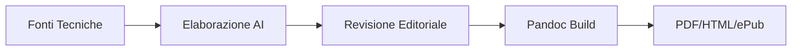

{width=300px height=100px}

# Manuale Operativo IA
## Guida pratica al

## Introduzione

Il presente progetto consiste nella realizzazione di un **Manuale Operativo sull'Intelligenza Artificiale** destinato a un'agenzia di comunicazione digitale. L'obiettivo è trasformare documentazione tecnica complessa (OpenAI Cookbook) in una guida accessibile per figure non tecniche. Il progetto integra tecniche di *Prompt Engineering* avanzate e un flusso di gestione documentale automatizzato per la pubblicazione multicanale (PDF, HTML, ePub).

## Ideazione 

### Tema
Il prodotto editoriale affronta l'integrazione delle tecnologie di Intelligenza Artificiale Generativa nei flussi di lavoro di un'agenzia di comunicazione. Con l'attenzione posta principalmente sul prompt engineering, il manuale è suddiviso in tre aree chiave:
* **Creazione di contenuti (Text Generation):** Ottimizzazione della produzione di contenuti testuali tramite diverse tecniche di prompting.
* **Riconoscimento Multilingua e Analisi Semantica(Language Detection):** Rilevazione automatica delle lingue e comprensione dei processi alla base (*Embeddings*).
* **Analisi e Affidabilità dei dati(Cross-tabular Analysis):** Protocolli per l'analisi incrociata di tabelle dati senza errori numerici e/o allucinazioni.

**Tendenza dell'attenzione:** L'interesse attuale si sta spostando dal semplice "uso del chatbot" verso la necessità di **validazione e affidabilità**. La tendenza del settore non è più solo la velocità di produzione, ma la capacità di costruire processi che garantiscano l'assenza di "allucinazioni", rendendo il tema del controllo qualità e della validità estremamente rilevante e attuale.

> LM2 slide 28

### Destinatari
Il manuale è progettato per assistere i lavoratori in situazioni di necessità operativa, fornendo protocolli chiari quando la complessità o il volume dei dati richiedono un supporto metodologico.

#### Persona 1: Martina, Senior Copywriter
* **Profilo:** 34 anni, responsabile della coerenza creativa per 5 account internazionali.
* **Bisogno:** Gestire picchi di lavoro multilingua senza sacrificare la precisione stilistica del brand.
* **Scenario d'uso:** Martina deve declinare una campagna social in 4 lingue diverse sotto una scadenza imminente. Temendo che l'IA possa generare traduzioni troppo letterali o "piatte", consulta il manuale per impostare un protocollo di *Persona Adoption* e *Language Detection*. Il manuale la assiste nel configurare i delimitatori corretti, permettendole di agire come supervisore di semilavorati già strutturati, validando rapidamente la coerenza linguistica invece di dover tradurre e correggere ogni singola riga manualmente.

#### Persona 2: Luca, Digital Strategist & Data Analyst
* **Profilo:** 29 anni, incaricato della reportistica e delle analisi di performance.
* **Bisogno:** Estrarre insight affidabili da dataset eterogenei evitando errori di calcolo fatali nei report per i clienti.
* **Scenario d'uso:** Luca deve incrociare i dati di spesa pubblicitaria (File A) con le conversioni effettive del CRM (File B). Consapevole della tendenza dell'IA a inventare correlazioni se lasciata libera, utilizza il manuale. Seguendo rigorosamente il protocollo di "Scomposizione Sequenziale" e "Validazione delle Formule", Luca guida l'IA passo dopo passo nella lettura dei file. Il manuale funge da guida procedurale che gli permette di produrre un report incrociato, eliminando il rischio di allucinazioni numeriche e sviste manuali tipiche dei fogli di calcolo complessi.

> LM2 slide 29-32

### Requisiti di accettazione
Perché il manuale sia considerato valido dai destinatari (Martina e Luca), deve soddisfare i seguenti requisiti di accettazione:

* **Precisione Operativa:** Ogni modulo deve contenere almeno un "Prompt Box" pronto all'uso (copia-incolla) che sia stato validato per ridurre il rischio di allucinazioni.
* **Accessibilità Multiformato:** Il prodotto deve essere fruibile sia da postazione desktop (durante l'analisi dati) che da dispositivi mobile (consultazione rapida durante i meeting), senza perdita di struttura.
* **Standard di Riferimento:** Si adottano gli standard **Markdown** per la sorgente e **Open Container Format (EPUB)** per la distribuzione mobile, garantendo l'interoperabilità e la conservazione a lungo termine.

**Modelli di fruizione:** Il modello più efficace è quello **ipertestuale e non lineare**. Mentre la lettura del singolo modulo è lineare per garantire la coerenza strutturale, l'indice deve permettere un accesso rapido alle soluzioni specifiche per i problemi del momento.

**Innovazione:** L'innovazione risiede nel **processo di fruizione**. Invece di un manuale statico, si è proposto un sistema di documentazione "attivo" generato tramite una pipeline automatizzata. Nella qualità dei contenuti, l'innovazione sta nella **mediazione editoriale** che trasforma documentazione per sviluppatori in istruzioni per creativi.

> LM4

### Canali di distribuzione
Il manuale è progettato per una diffusione capillare all'interno dell'ecosistema dell'agenzia:

1.  **Intranet Aziendale (Web/HTML):** Il canale principale per la consultazione rapida durante il lavoro d'ufficio. Formato: **HTML**.
2.  **Repository di Produzione (Markdown):** Per il team tecnico che intende aggiornare i prompt. Formato: **MD**.
3.  **Dispositivi Mobile (ePub):** Per la lettura in mobilità o durante i tempi morti. Formato: **ePub 3.0**.
4.  **Archivio Formale (PDF):** Per la conservazione della versione ufficiale e la stampa di singoli moduli. Formato: **PDF**.

**Identità visuale e Stile:**
Il progetto adotta un'**estetica funzionale-operativa**, dove le scelte di design sono subordinate all'usabilità del contenuto.
* **Tipografia:** Uso di font *sans-serif* per il corpo del testo (leggibilità digitale) e font *monospaced* per i prompt (distinzione netta tra istruzione e testo narrativo).
* **Elementi grafici:** Uso di icone(✅,❌) e box colorati per distinguere il
testo dagli esempi, facilitando la scansione visiva della pagina.

## Processo di Produzione

### Acquisizione dei contenuti
Le fonti sono tratte dal repository di OpenAI Cookbook(https://github.com/openai/openai-cookbook). Il costo di acquisizione è nullo a livello economico (fonti libere), mentre parecchio dispendioso temporalmente (analisi attenta di molti documenti).

### Gestione documentale

Il flusso prevede: (i) raccolta sorgenti MD, (ii) traduzione e trasformazione per l'adattamento del registro, (iii) strutturazione dei moduli, (iv) applicazione dello stile CSS, (v) build multiformato tramite Pandoc.

> LM2 slide 14-26

### Tecnologie adottate

L'architettura del progetto si basa su un ecosistema di tecnologie *open-source* e standard aperti, scelti per garantire la massima portabilità del manuale e l'automazione del flusso editoriale.

#### Descrizione delle tecnologie
* **Markdown (MD):** Linguaggio di marcatura leggero scelto come formato sorgente. La sua natura "plain text" permette di mantenere i prompt puliti da metadati invisibili (tipici di Word) che potrebbero corrompere l'output dell'IA.
* **Python (Scripting & Automation):** Linguaggio alla base della pipeline editoriale. Il software sviluppato si divide in due componenti logiche: 
    1. **Fase di Normalizzazione (`cleaning.py`):** Agisce sulla sorgente grezza per eliminare il rumore tecnico (tag JSX, link proprietari, residui di codice) tramite espressioni regolari (Regex).
    2. **Fase di Pubblicazione (`build.py`):** Gestisce il sistema di build multiformato, orchestrando Pandoc e garantendo che i file vengano uniti secondo un ordine logico predefinito e non casuale.
* **Pandoc:** Motore universale di conversione documentale. È il perno del flusso multicanale, capace di trasformare la sorgente Markdown in output professionali (PDF, HTML, ePub) mantenendo la coerenza semantica.
* **CSS:** Utilizzato per definire l'identità visuale. In questo progetto, il CSS non ha solo un ruolo estetico, ma funzionale: serve a differenziare visivamente le "istruzioni operative" dalla "narrazione teorica". 

#### Contributo agli scenari d'uso
Il motivo per cui questo workflow genera un manuale adatto agli scenari d'uso citati risiede nella qualità di **formattazione** e **adattamento del registro tecnico**:

1.  **Efficienza e prontezza (Scenario Martina):** La combinazione di Markdown e Pandoc permette di generare un formato ePub ottimizzato. Questo garantisce a Martina di avere i protocolli di *copywriting* sempre disponibili sul suo smartphone o tablet, pronti per essere consultati e copiati durante i meeting creativi senza dover dipendere da un computer desktop.
2.  **Affidabilità e Sicurezza (Scenario Luca):** L'utilizzo di Python per la trasformazione dei contenuti permette di inserire nel manuale box di controllo e checklist validate. La struttura rigida imposta dal Markdown forza Luca a seguire una lettura lineare e sequenziale dei dati, impedendo "scorciatoie" mentali che porterebbero ad allucinazioni numeriche.

| Tecnologia | Contributo allo Scenario 1 (Martina) | Contributo allo Scenario 2 (Luca) |
| :--- | :--- | :--- |
| **Markdown** | Facilità di copia dei prompt senza errori di formattazione. | Struttura logica rigorosa per protocolli analitici. |
| **Python** | Trasforma testi tecnici in istruzioni creative pronte all'uso. | Integra protocolli di ragionamento logico nei moduli di analisi. |
| **Pandoc** | Accesso multicanale (ePub per consultazione rapida). | Esportazione in PDF per reportistica immutabile. |
| **CSS** | Identificazione immediata delle aree di prompt operativo. | Gerarchia visiva per le checklist di controllo qualità. |

### Esecuzione del flusso
Allegare, possibilmente attraverso il riferimento ad un repository documentale, i materiali, gli script, le configurazioni, che permettono di riprodurre il flusso di produzione documentale. I contenuti non devono necessariamente essere completi, può essere sufficiente fornire un prototipo per ogni tipologia di contenuto previsto e per ogni formato di destinazione previsto.  

### Utilizzo di intelligenza artificiale generativa

Descrivere in quali fasi del flusso di gestione documentale è stata integrata l'IA generativa e con quali obiettivi. Indicare le tecnologie adottate (modelli di linguaggio, sistemi di analisi dati, computer vision) e per quale tipo di elaborazione. Descrivere l'approccio di prompt engineering adottato e i metodi utilizzati per validare la qualità degli output generati. Valutare il contributo dell'AI in termini di riduzione dei tempi, miglioramento della qualità e scalabilità raggiunta, evidenziando anche i limiti emersi e la necessità di intervento umano.

## Valutazione dei risultati raggiunti

### Valutazione del flusso di produzione

Per valutare il contributo proposto valutare le diverse fasi del flusso in termini di (i) riduzione dei tempi di gestione documentale, (ii) riduzione degli errori, (iii) miglioramento della qualità dei documenti, (iv) miglioramento del livello di accettazione della tecnologia, (v) raggiungimento di nuovi canali di distribuzione, (vi) soddisfacimento di nuovi scenari d'uso.

### Confronto con lo stato dell'arte

Può anche essere utile confrontare una versione ASIS del flusso di gestione, senza la tecnologia o le innovazioni proposte, e una TOBE che include la tecnologia e le innovazioni proposte dallo studente.

### Limiti emersi

È importante sottolineare i limiti emersi. Come l'impossibilità di accesso ad alcune tecnologie o fasi del flusso di gestione documentale, limiti nella automazione di alcune passi di trasformazione dei formati o di integrazione delle sorgenti

## Conclusioni

Discutere i risultati ottenuti, verificando se gli obiettivi definiti dai casi d'uso siano pienamente o parzialmente raggiunti. Evidenziare gli aspetti nei quali si sono raggiunti i risultati più soddisfacenti e le limitazioni emerse.

## Bibliografia e sitografia

Elencare i riferimenti bibliografici e risorse online che hanno maggiormente contribuito alla realizzazione del progetto. Ad esempio [@sechi2010,@pantieri2021,@ceravolo2025]
